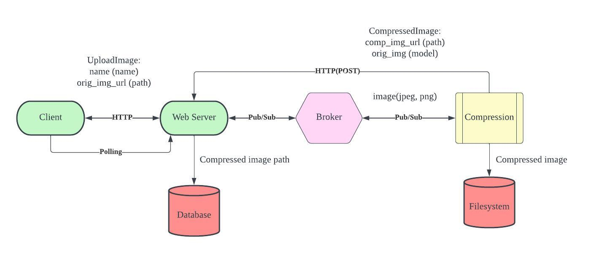

# Image Compressor using MQTT

This is a simple project where you can upload an image through the browser, and the compressor component will automatically compress the image and save it to your Pictures folder.

Using MQTT provides a more modularized system.By utilizing the Pub/Sub function, it would much easier to add more features other from the compressor.

## System Design



## Environment

```
- Ubuntu 18.04.6 LTS
- Python 3.9
```

## How To Run

1. Install Python packages

```
python3 -m pip install -r requirements.txt
```

2. Connect compressor to broker, and you will see "Successfully connected to MQTT broker" in the terminal.

```
python3 compressor.py
```

3. Start your Web Server

```
cd mqtt_test
python3 manage.py runserver --noreload
```

4. Send an image through the image form, and you will see the saved path of your compressed image on the browser page.
